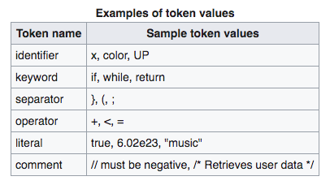

# Lexing & Parsing
Very halpful: [An Overview of Lexing & Parsing](http://savage.net.au/Ron/html/graphviz2.marpa/Lexing.and.Parsing.Overview.html#An_Overview_of_Lexing_and_Parsing). They happen in alphabetical order: Lexing then Parsing

## LEXING
  - [Wikipedia](https://en.wikipedia.org/wiki/Lexical_analysis) **Lexing** is tokenising a stream of text, which means chopping that input stream into discrete tokens, and identifying the type of each token. The output is a new stream, this time of stand-alone tokens.
  - Analysis generally occurs in one pass.
  - Lexing can be divided into two stages:
    - the scanning, which segments the input string into syntactic units called *lexemes* and categorizes these into token classesA lexeme is a sequence of characters in the source program that matches the pattern for a token and is identified by the lexical analyzer as an instance of that token.
    - the evaluating, which converts lexemes into processed values.
    

  So this:
  ```js
  x = a + b * 2;
  ```
  once it's lexed yields something like this:
  ```js
  [(identifier, x), (operator, =), (identifier, a), (operator, +), (identifier, b), (operator, *), (literal, 2), (separator, ;)]
  ```
  - for the string `The quick brown fox jumps over the lazy dog`
    - The tokens could be represented in XML,
      ```
      <sentence>
        <word>The</word>
        <word>quick</word>
        <word>brown</word>
        <word>fox</word>
        <word>jumps</word>
        <word>over</word>
        <word>the</word>
        <word>lazy</word>
        <word>dog</word>
      </sentence>
      ```
    - or as an [s-expression](https://en.wikipedia.org/wiki/S-expression) (for "symbolic expression", a notation for nested list (tree-structured) data)
      ```
      (sentence
        (word The)
        (word quick)
        (word brown)
        (word fox)
        (word jumps)
        (word over)
        (word the)
        (word lazy)
        (word dog))
      ```
  - Tokens are identified based on the specific rules of the lexer. Some methods used to identify tokens include:
    - regular expressions
    - specific sequences of characters termed a flag
    - specific separating characters called delimiters
    - explicit definition by a dictionary
    - Special characters, including punctuation characters, are commonly used by lexers to identify tokens because of their natural use in written and programming languages.
  - Tokens are often categorized by character content or by context within the data stream. Categories are defined by the rules of the lexer. Categories often involve grammar elements of the language used in the data stream. Programming languages often categorize tokens as
    - identifiers
    - operators
    - grouping symbols
    - data type
  - A lexical analyzer generally does nothing with combinations of tokens, a task left for a parser.
    - EX: recognizes parentheses as tokens, but doesn't match a `(` with a `)`
  - **STAGES OF LEXING**
    - Scanner: Finite state machine that has encoded all possible sequences of characters that can be contained within any of the tokens it handles... reads a stream of characters, identifies the lexemes in the stream.
    - Evaluator: Creates tokens. Goes over the characters of a lexeme to produce a value. the lexeme's type combined with its value is a token which can be given to the parser.
      - some lexemes (like parentheses) don't have values
      - can supress some lexemes completly, concealing it from the parser (ex: whitespace or comments)
      For example, in the source code of a computer program, the string
        `net_worth_future = (assets - liabilities);`
      might be converted into the following lexical token stream; whitespace is suppressed and special characters have no value:
      ```
        IDENTIFIER net_worth_future
        EQUALS
        OPEN_PARENTHESIS
        IDENTIFIER assets
        MINUS
        IDENTIFIER liabilities
        CLOSE_PARENTHESIS
        SEMICOLON
      ```
## PARSING
  - [Wikipedia](https://en.wikipedia.org/wiki/Parsing) - The **parser** concerns itself with the context in which each token appears, which is a way of saying it cares about whether or not the sequence and combination of tokens actually detected fits the expected grammar.
